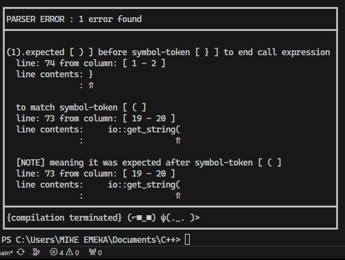

# LearningCpp
Cpp cloud repository for vs code.

This repository contains code, sometimes unrelated, that are products of my C++ learning journey.
References to sites like:
1. [learncpp.com](www.learncpp.com) the best by far
2. [Programiz.com](www.Programiz.com)
3. [codecademy.com](www.codecademy.com)
and many others.

### 01/01/2024 Introduction to my Programming Language NC
Hello to the parties interested, i am currently working on a compiler for my programming language called **NC** - short for not C;
I also have a partially-implemented pl0 compiler that compiles down to the **C** programming language.

### 07/01/2024 Utf8 Finally
I have wriiten a custom utf8 chracter class and also made a utf8 string class from std::basic_string<CharT, CharTraits> enable unicode support in my language.
It can be found in file [myfunctions1.cpp](myfunctions1.cpp). **Fuck icu and boost, i made my own😎**.

### 05/03/2024 MORE DETAILS ON MY LANGUAGE
My language contains or is going to contain various existing programming features and more:
- sum types
- produc types
- classes
- function as objects
- compileTime ability to run code
- generics in form of templates
- match expressions
- **Decimal floating point** implementation devoid of the inherent problems of the **IEEE binary floating point**
- Wide variety of types
- Static and Strong typing, with no implicit conversions
- Interface programming
- When the time comes, **concurrent, asynchronus and event-driven** programming
- Low level to some degree
- Memory safety(done with no Gargbe collector) and pointer/references limitations
- Bounds checking
- No explicit memory allocation and No explicit memory deallocation
- Array indexing starting from **1**
- Unicode agnostic language, with capability of using ***emoji identifiers***
- pseudo-minimalist array of language keywords
- expressivness
- ability to imbed other languages to NC *a bit optimistic for now*
- compiler attributes and so much more.
**Languages like: _Python, Rust, Haskell, Lisp, Zig, C++, D and C_ have set the bar way too high, but i still aim to reach it**

The files invloved in my programming language building journey
+ [NcLog.h](header/NcLog.h) _: contains class Nc::Log, responsible for error logging_
+ [NcLexer.h](header/NcLexer.h), [NcLexer.cpp](NcLexer.cpp) _: contains class Nc::Lexer, responsible for lexing nc files_
+ [NcParser.h](header/NcParser.h), [NcParser.cpp](NcParser.cpp) _: contians class Nc::Parser, responsible for parsing nc files(also contains BNF for my language)_
+ [NcNonTerminal.h](header/NcNonTerminal.h), [NcTerminal.h](header/NcTerminal.h) _: contians classes that represent Ast nodes in my language_
+ [NcAst.h](header/NcAst.h), [NcAst.cpp](NcAst.cpp) _: contains class Nc::Ast, responsible for building Nc's Ast. The Ast is really beautiful, will show later_
+ [NcSemantics.h](header/NcSemantics.h) and [NcSemantics.cpp](NcSemantics.cpp) _: currently empty, but would contain class Nc::Semantics that would be responsible for semantic checking_
+ [NcCodeGen.h](header/NcCodeGen.h) and [NcCodeGen.cpp](NcCodeGen.cpp) _: currently deprecated for now(but i am using LLVM for codegen)_
+ functionality only independent files: [readfile.h](header/readfile.h), [drawboxaroundtext.h](header/drawboxaroundtext.h), 
[myfunctions1.h](header/myfunctions.h)  [myfunctions1.cpp](myfunctions1.cpp)

Below is an example error produce from my language, NC:

Thanks to ***07/01/2024 unicode update***, my language is now unicode agnostic, but some unicode characters are still not allowed as identifiers.
I haven't solidified acceptable unicode characters yet, but i will when i have time, or if you wish to help in that field, pls contact me through my email
[emekacryil@gmail.com](emekacryil@gmail.com)

> [!NOTE]
> **i rarely do commit, but if you want to view my local changes, you can always just ask, so that i would commit the new changes**
 

## LICENSE
none for now, but pls in good conscience, when you need to distribute my code add the source from where it came from, thank you.

[^1]: ***A more better readme file is coming soon, explaining all the various file meaning in this repo***